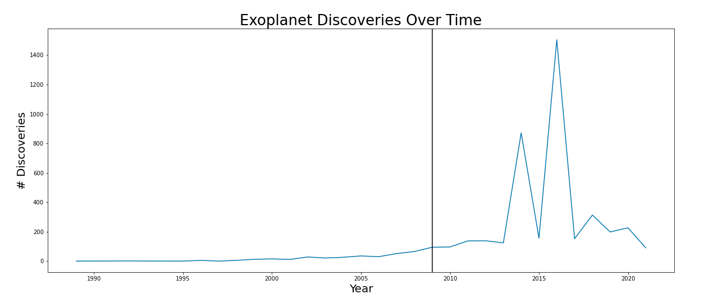
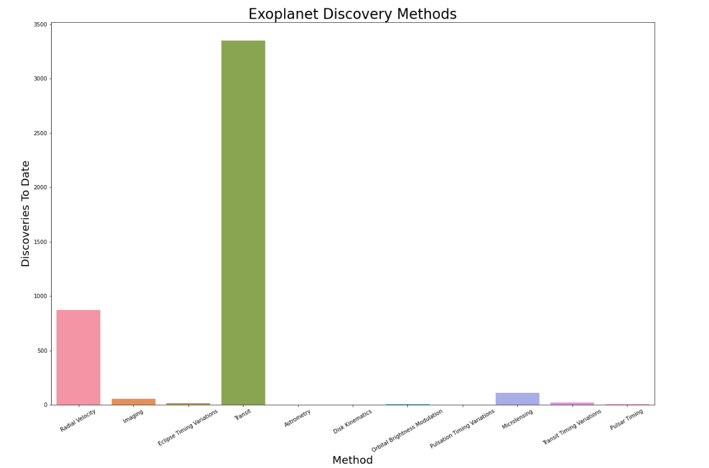
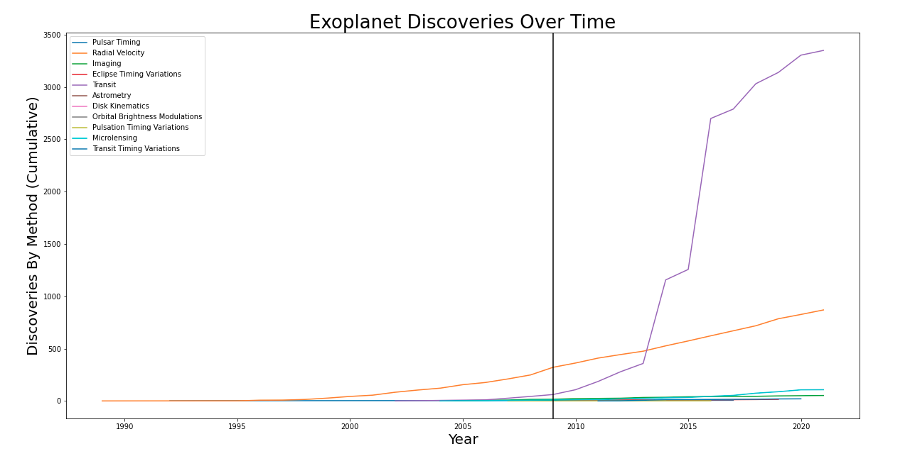
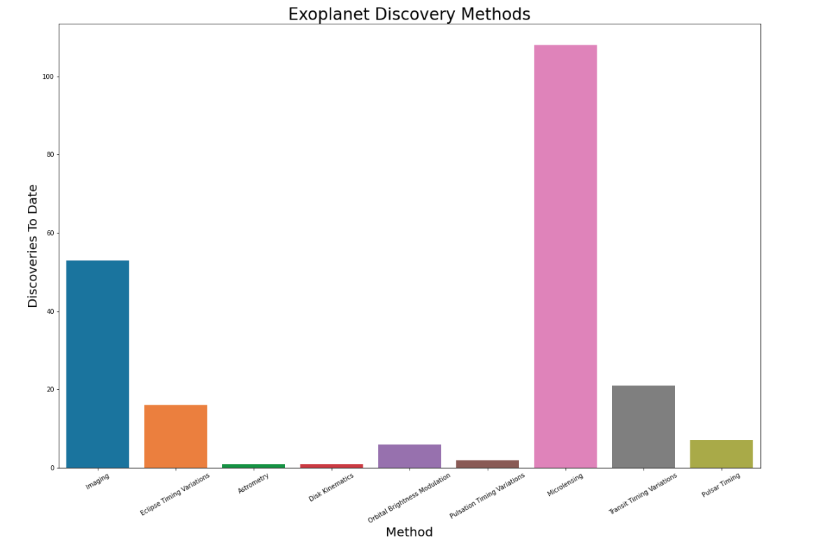

*** 
## Dust In The Wind
#### An Analysis Of Exoplanets Discovered As Of July 2021, by Matt Edrich 
***

***
### Motivation

Who among us has not looked up at the night sky and wondered "Who, or what, is out there?" Between our scientific capailities of cosmic discovery, and our budding technical abilities for space travel, humanity seems destined to spread beyond the bounds of the Earth (amidst a lot of controversy, to be sure). Given that we are at the very beginning of this new inky black frontier, I wanted to investigate how we make our discoveries, what we have discovered so far, and what our discoveries can tell us.

Some fun, relevant facts to get us started:

* Humanity has discovered more than 4,000 extrasolar planets ("exoplanets") as of July 1, 2021.
* Elon "Space Child" Musk, currently the world's second wealthiest person, and owner of SpaceX, has stated that his primary motivation for all his enterprises is to colonize Mars.
* Jeff Bezos, currently the world's wealthiest person, embarked on the world's first commercial space flight on July 20, 2021.

***

***
### The Data

For this analysis, I worked with a customized version of <a href="https://exoplanetarchive.ipac.caltech.edu/cgi-bin/TblView/nph-tblView?app=ExoTbls&config=PSCompPars" target="_blank">NASA's Exoplanet Archive</a>, specifically the Composite Planet Data Table. As it turns out, many teams around the world publish inidividual findings about the same exoplanets, and this table formats all that data so that there is one row per discovered planet - this means that some of my data may be coming from multiple sources.

My raw data arrived in 89 columns. Based on the questions I sought to explore, I determined that I only needed 21 of those. I selected for columns that gave me insight on the methods and timeline of discovery, and basic metrics about the exoplanets themselves (such as mass, temperature, radius, and galactic position).

#### Prudent Context:

To date, we have confirmed the discovery of 4,434 exoplanets, with thousands more discoveries awaiting confirmation. 2,012 of these have masses in excess of 10 Earth masses (the largest known being **239,000 times the mass of the Earth!**). <a href="https://www.universetoday.com/13757/how-big-do-planets-get/" target="_blank">People smarter than me have suggested that the upper bound for "Earth-like" (aka rocky) planets occurs at roughly 2 Earth Radii, or 5-10 Earth Masses</a>. As I am ultimately interested in investigating how conditions on Earth compare to conditions observed elsewhere, I have chosen to limit my data to those exoplanets with masses up to 10 times that of the Earth.

***Let's Begin!***
***

***
### How Do We Search For Exoplanets?

The first exoplanet was discovered in 1989, but not confirmed until 1992. Since then, we have steadily discovered more and more exoplanets per year with a major peak occurring in 2016. The 2009 launch of the Kepler Space Telescope (retired as of 2018), a spacecraft designed and launched specifically for exoplanet discovery, had a massive impact on how we discover exoplanets. It's launch is marked by the vertical black line in the chart below.

We have many Earth-based telescopes that discover exoplanets. However, space-based telescopes that don't have to deal with any of the challenges imposed by Earth's atmosphere are by far the most productive method of discovery. TESS (#6 as of this analysis) is the official successor of Kepler.

Discovering a planet by transit means that it passed directly between it's star and the observer - this is Kepler's purpose-built specialty. Technically, there are eleven methods of exoplanet discovery that appear in scientific literature, although there are really two primary methods.

The launch of Kepler has had a huge impact on our rate and process of discovering exoplanets! Let's see how all the discovery methods compare against each other other over time. Again, Kepler's launch is denoted by the vertical black line.

Given that 3,349 exoplanets have been discovered by Transit, and a further 870 discovered by Radial Velocity, let's remove these extremes and see how the rest of the data compares.

Fascinatingly, the combined counts of all discoveries represented by the above chart represent less than 5% of all exoplanet discoveries. 
***

***
### What Do We Know About Exoplanets?
***

