*** 
## Dust In The Wind
#### An Analysis Of Exoplanets Discovered As Of July 2021, by Matt Edrich

***

***
### Motivation

Who among us has not looked up at the night sky and wondered "Who, or what, is out there?" Between our scientific capailities of cosmic discovery, and our budding technical abilities for space travel, humanity seems destined to spread beyond the bounds of the Earth (amidst a lot of controversy, to be sure). Given that we are at the very beginning of this new inky black frontier, I wanted to investigate how we make our discoveries, what we have discovered so far, and what our discoveries can tell us.

Some fun, relevant facts to get us started:

* Humanity has discovered more than 4,000 extrasolar planets ("exoplanets") as of July 1, 2021.
* Elon "Space Child" Musk, currently the world's second wealthiest person, and owner of SpaceX, has stated that his primary motivation for all his enterprises is to colonize Mars.
* Jeff Bezos, currently the world's wealthiest person, embarked on the world's first commercial space flight on July 20, 2021.

***

***
### The Data

For this analysis, I worked with a customized version of <a href="https://exoplanetarchive.ipac.caltech.edu/cgi-bin/TblView/nph-tblView?app=ExoTbls&config=PSCompPars" target="_blank">NASA's Exoplanet Archive</a>, specifically the Composite Planet Data Table. As it turns out, many teams around the world publish inidividual findings about the same exoplanets, and this table formats all that data so that there is one row per discovered planet - this means that some of my data may be coming from multiple sources.

My raw data arrived in 89 columns. Based on the questions I sought to explore, I determined that I only needed 21 of those. I selected for columns that gave me insight on the methods and timeline of discovery, and basic metrics about the exoplanets themselves (such as mass, temperature, radius, and galactic position).

***Let's Begin!***
***

***
### **How Do We Search For Exoplanets?**

#### - ***Discoveries Over Time***
* The first exoplanet was discovered in 1989, but not confirmed until 1992. 
* Since then, we have steadily discovered more and more exoplanets per year with a major peak occurring in 2016. 
* The 2009 launch of the Kepler Space Telescope (retired as of 2018), a spacecraft designed and launched specifically for exoplanet "hunting", had a massive impact on how we discover exoplanets. It's March 7, 2009 launch is marked by the vertical black line in the chart below.

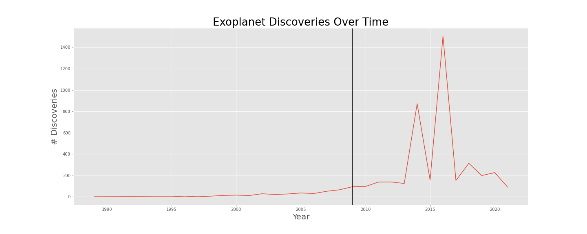

#### - ***Prolific Discovery Facilities***

* We have many Earth-based telescopes that discover exoplanets.
* Space-based telescopes that don't have to deal with any of the challenges imposed by Earth's atmosphere are by far the most productive method of discovery. 
* Kepler is actually more dominant than this chart immediately suggests: Kepler suffered a major malfunction in 2013, and lost it's ability to stay pointed on target without drifting off course. NASA energized devised a method to stabilize it with **the pressure of sunlight**, and when the fix worked, Kepler was reborn as 'K2'. 
* TESS (#6 as of this analysis) is the official successor of Kepler/K2.

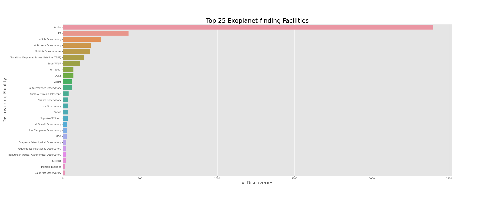

#### - ***Methods Of Discovery***

* Discovering a planet by **transit** means that it passed directly between it's star and the observer - this was Kepler/K2's purpose-built specialty.
* **Radial velocity** was the method by which the first exoplanet was discovered; when a star has a planet orbiting it, that planet will very slightly "tug" the star in space throughout it's orbital course, causing the star itself to oscillate between moving closer and moving farther from us - this in turn shifts the redness/blueness of the star as we see it, indicating the presence of planets.
* The launch of Kepler has had a huge impact on our rate and process of discovering exoplanets! Let's see how all the discovery methods compare against each other other over time. Again, Kepler's launch is denoted by the vertical black line.

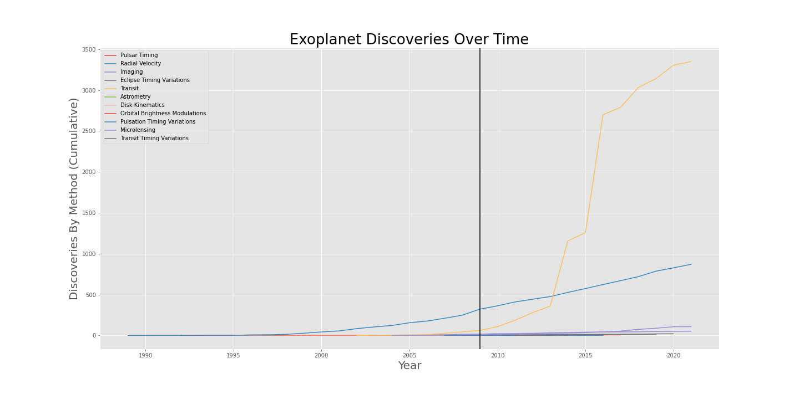

***

***
### What Do We Know About Exoplanets?

#### Important Context:

To date, we have confirmed the discovery of 4,434 exoplanets, with thousands more discoveries awaiting confirmation. 2,012 of these have masses in excess of 10 Earth masses (the largest known being **239,000 times the mass of the Earth!**). <a href="https://www.universetoday.com/13757/how-big-do-planets-get/" target="_blank">People smarter than me have suggested that the upper bound for "Earth-like" (aka rocky) planets occurs at roughly 2 Earth Radii, or 5-10 Earth Masses</a>. As I am ultimately interested in investigating how conditions on Earth compare to similar "possibly habitable" conditions observed elsewhere, I have chosen to limit my data to those exoplanets with masses up to 10 times that of the Earth from here on.

#### - ***Where Are All These Other Rocks?***

* **Right Ascension** is an ancient astronomical measure that indicates a celestial object's angular distance, eastward, along the celesial equator from the Sun at the Spring Equinox. It is usually given in terms of hours:minutes:seconds, but here I have converted it to radian degrees. You can think of it as the x-coordinate in a spherical space.
* **Declination** is also an ancient astronomical measure that indicates a celestial object's angular distance north or south of the celestial equator. 
* The large cluster of points in the upper left quadrant is a constellation known as Cygnus (The Swan), and is directly aligned with the plane of the Milky Way.
* The faint horizontal S-shape discernible from roughly -30 to +30 degrees is known as the *plane of the ecliptic* and is where we find the zodiacal constellations.

#### - ***Comparison Of Basic Planetary Metrics***

In the following three scatterplots, Earth is represented by a teal dot.

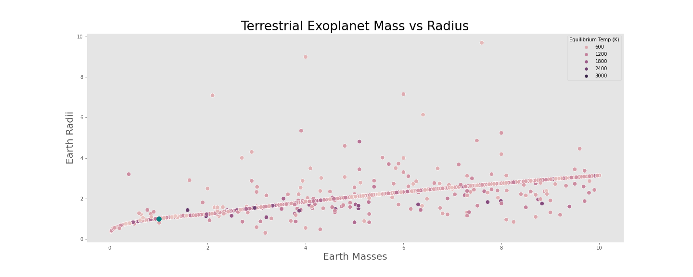

* There is a strong correlation between mass and radius (I was not expecting this!).

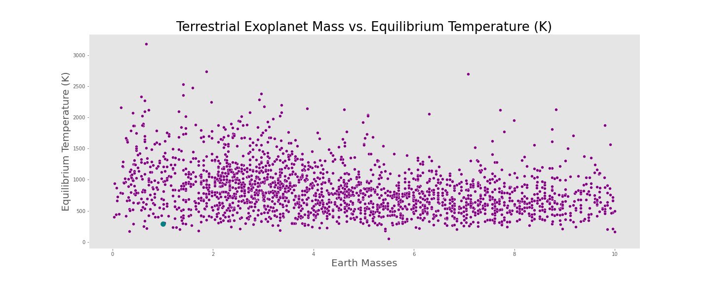

* There is no significant correlation between mass and temperature.

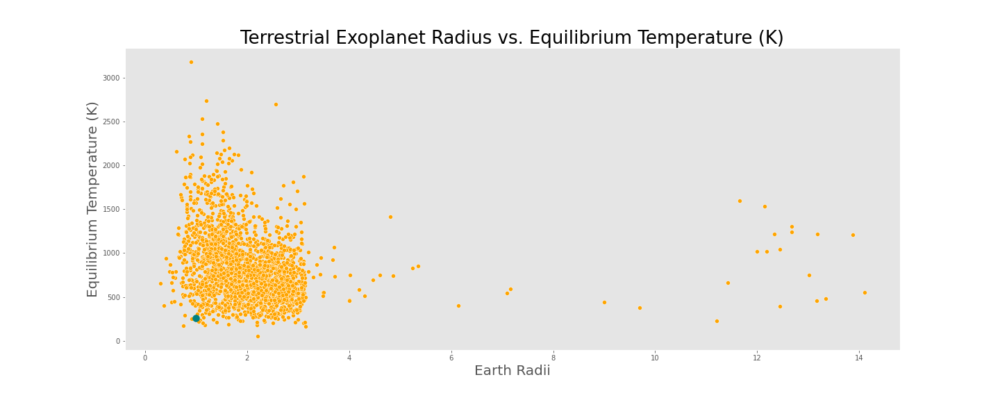

* Likewise, there is no significant correlation between radius and temperature.

### - ***Testing Hypotheses***

* Ho: For a given metric (mass, temperature, or radius), Earth's mean will be the population mean.
* Ha: For a given metric (mass, temperature, or radius), Earth's mean will differ from the population mean.

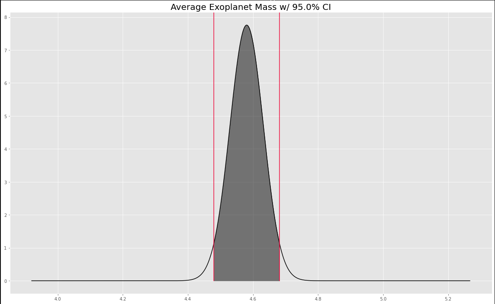

* Here, the x-axis is in terms of **Earth masses**: obviously Earth's mass measured in Earth masses is one! It doesn't even come close to the average.
* Lower, upper bounds of 95% CI: (4.48 EM, 4.68 EM)

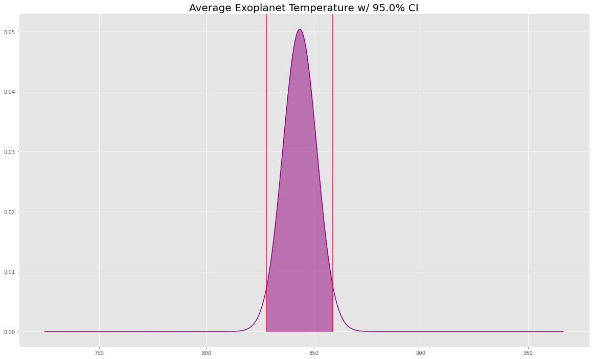

* Here, the x-axis is in **degrees Kelvin**; Earth's equilibrium temperature is 288K.
* Lower, upper bounds of 95% CI: (828.01 K, 859.03 K)

* Here, the x-axis is in **Earth radii**; Earth's radius is such units is 1.
* Lower, upper bounds of 95% CI: (1.96 ER, 2.05 ER)

**Considering how far away Earth's metrics are from the true population means in each case, I saw no need to use p-values or graphics to underline this point:** ***Earth is very special, and quite unique amongst rocky planets!***

...but I do want to highlight how lucky we are to live here.

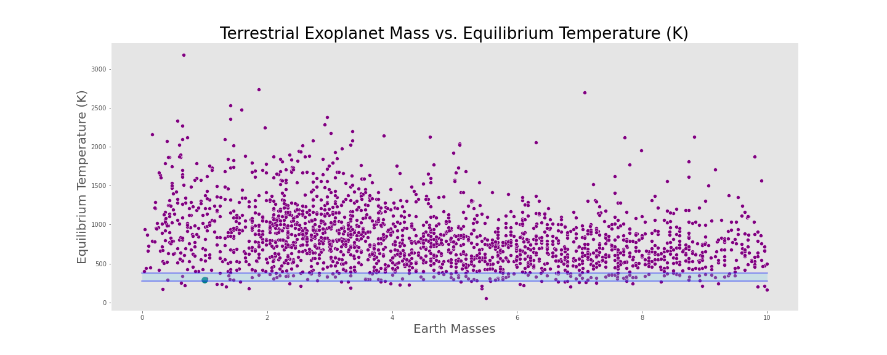

* This is the same chart as seen earlier, comparing the masses of exoplanets to their temperatures.
* Now, I have highlighted the temperature region in which liquid water can exist.
* There are 112 planets (including the Earth!) out of the 4,442 (this dataset plus our solar system) that are both small enough to be rocky, and are in the temperature range for to support water-based chemistry.
* That is a mere **2.5%** of planets discovered so far!

***

***
#### Going Beyond

* Wait for more data to mine!
* Clean-up and embellish charts
* Expand and diversify functionality
* Explore the mathematical relationship between planetary mass and planetary radius
* Analyze the 111 planets noted above in **much** greater detail - which one is the best choice for a Voyager-like spacecraft to be sent?
* Can this data shed any light on the mysteries invoked by the <a href="https://exoplanets.nasa.gov/news/1350/are-we-alone-in-the-universe-revisiting-the-drake-equation/" target="_blank">Drake Equation?</a>

## Thank you. Live long and prosper. Queries?

***

### Bonus Material

#### Counts of Exoplanet Discoveries by Method, All:

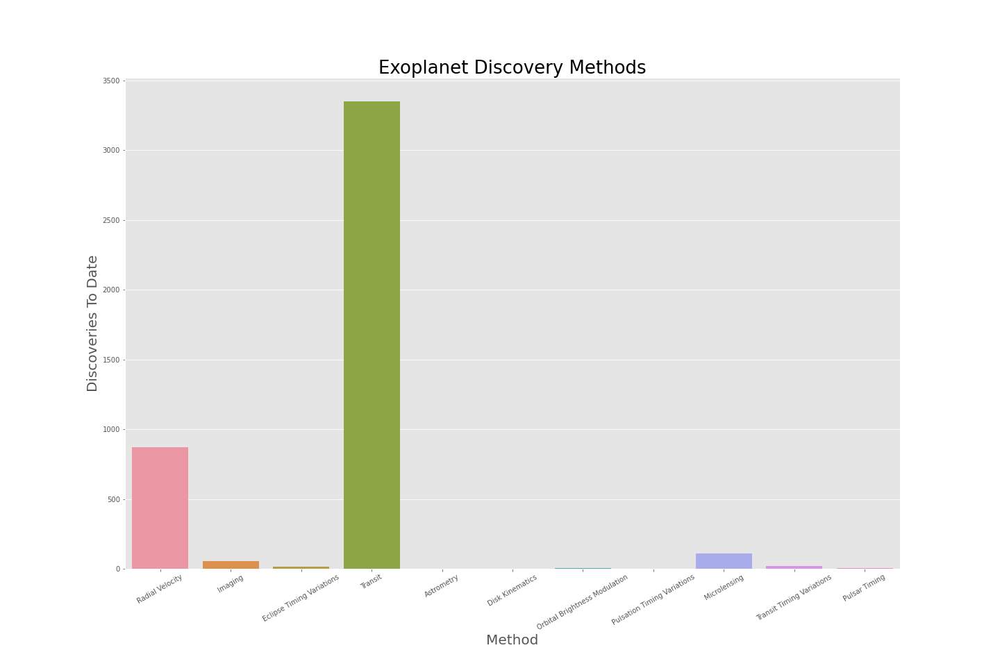

#### Counts of Exoplanet Discoveries by Method, Excluding Top Two

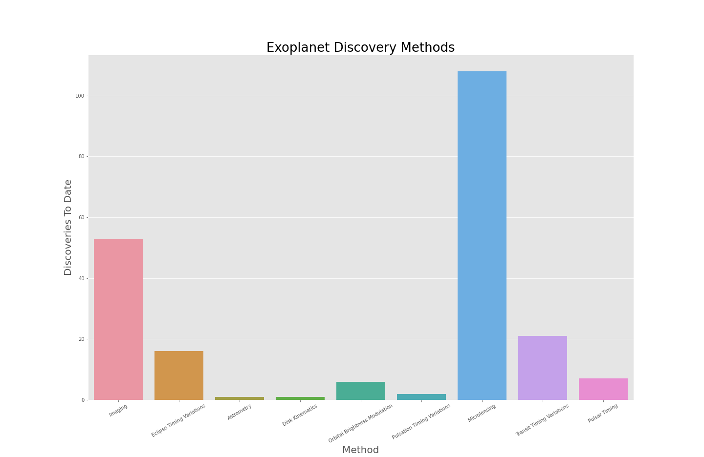

#### TatONEines, TaTWOines, and TatTHREEines:

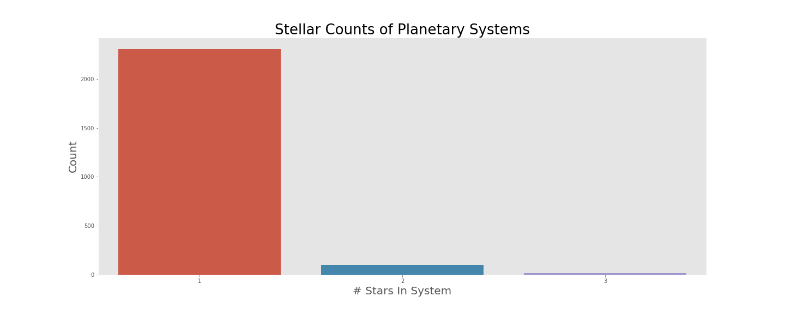

#### The Number Of Planets In Discovered Systems:

#### 80% Confidence Interval of Exoplanet Orbital Periods (aka "Years"):

* x-axis is in Earth days

#### 87% Confidence Interval of Exoplanet Orbital Eccentricities:

